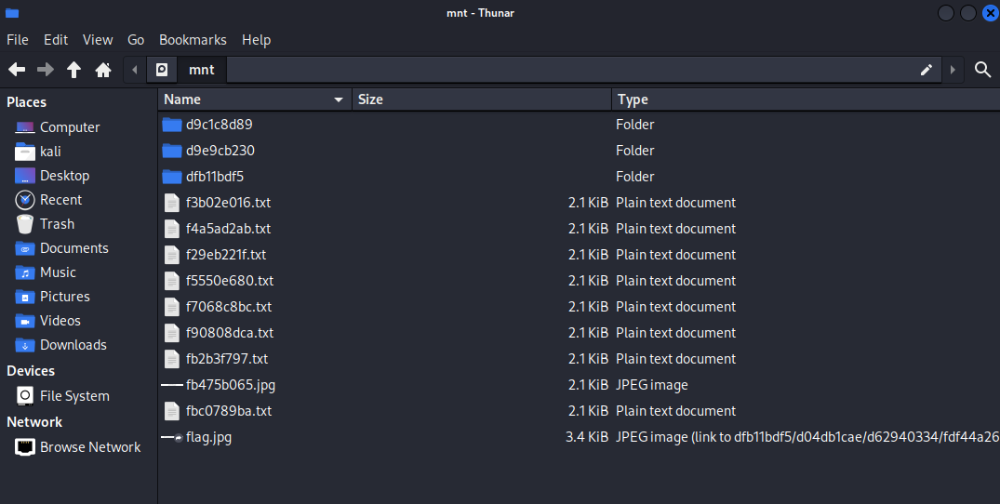

# RE: Network Disk Forensics

## Challenge

Dear Jelly,

Nobody likes having to download large disk images for CTF challenges so this time we're giving you a disk over the network!

Regards,  
jscarsbrook

AU: `nc chal.2025.ductf.net 30016`  
US: `nc chal.2025-us.ductf.net 30016`

---

Anyone who has done analysis of a disk image can tell you that to take a forensic image of a computer hard drive means copying the whole drive, bit for bit - even the unused regions or empty partitions. So, if the hard drive is 1TB, you end up with a disk image that is 1TB.

Needless to say, sometimes these things can be unwieldy to work with - especially if you have to wait for them to copy onto your machine, or to download off a server. 

The goal of this challenge is to examine a forensic disk image over the network, to avoid this very problem. Honestly, I didn't know this was a thing!

So, before we attempt to log into the server over port 30016, lets take a look at what else we have to work with.

# Analysis of Provided Files

The files we were provided for this challenge were:
- main.go,
- go.sum, and
- go.mod.

The only file we really care about (i.e., the one that provide us anything of note), is *main.go*.

I've listed the contents of each file at the end of this writeup, but I'll highlight the relevant sections of *main.go* for you now.

**generateTextPNG**
```
// GenerateTextPNG creates a PNG image with the given text string.
// filename: the name of the output PNG file.
// text: the string to draw on the image.
// width: the width of the image.
// height: the height of the image.
func generateTextPNG(text string, width int, height int) ([]byte, error) {
...
}
```

The comment and the file name really say it all. The `generateTextPNG` function creates an image that contains a given text string. It's safe to assume the input string is the flag. However, it's **not** safe to assume that this function is really generating a PNG image (more on this later).

**appMain**
```
func appMain() error {
	flag.Parse()

	ctfFlag := os.Getenv("FLAG")
	if ctfFlag == "" {
		ctfFlag = "FLAG{dummy}"
	}

	...

	if *listenNbd != "" {
		...

		for {
			conn, err := listen.Accept()
			...

			go func(c net.Conn) {
				...

				// generate the filesystem
				dir, err := generateFilesystem(
					ctfFlag,                        // the flag to be placed in the filesystem
					*levels,                        // number of levels in the filesystem
					*dummyFilesPerDirectory,        // number of dummy files per directory
					*dummyImagesPerDir,             // number of dummy images per directory
					*spreadDirectoriesPerDirectory, // number of directories to spread per directory
				)
				...

				// convert the filesystem to an ext4 block device
				blockDevice, err := filesystemToExt4(dir)
				if err != nil {
					slog.Error("failed to convert filesystem to ext4 block device", "err", err)
					return
				}

				...
			}(conn)
		}
	}

	return fmt.Errorf("no action specified, use -write-file or -listen-nbd")
}
```

The *appMain* function is the entry point of the program. Even if we can't read the code, we can get a pretty good idea of what's going on by reading the comments.

When the application starts, it generates a file system and converts the filesystem to an ext4 block device. You'll notice that the *generateFilesystem* takes the flag variable as the first argument. You could trace the function calls to see exactly how the program uses the flag... or you could save yourself the trouble and reasonably assume it's being passed to the function that creates an image from a string. (And you'd be right.)

We can validate our assumption with the following code extract from the *generateFilesystem* function. Don't bother reading the code (I mean I didn't, but don't let me tell you what to do), we can get all the info we need by reading the comments.

```
	// pick a random bottom directory to place the flag
	if len(bottomDirs) == 0 {
		return nil, fmt.Errorf("no bottom directories available to place the flag")
	}
	randomIndex := mathRand.Int32N(int32(len(bottomDirs)))
	bottomDir := bottomDirs[randomIndex]
	flagFileName := generateFilename("f", 4, ".jpg")

	// generate the flag file
	flagFile, err := generateImageFile(flag)
	if err != nil {
		return nil, fmt.Errorf("failed to generate image file for flag: %w", err)
	}

	// add the flag file to the chosen bottom directory
	if _, err := bottomDir.dir.Create(flagFileName, flagFile); err != nil {
		return nil, fmt.Errorf("failed to add flag file to bottom directory: %w", err)
	}

	// make a symlink to the flag file in the challenge directory
	symlink := filesystem.Factory.NewSymlink(path.Unix.Join(bottomDir.path, flagFileName))
	if _, err := challengeDir.Create("flag.jpg", symlink); err != nil {
		return nil, fmt.Errorf("failed to create symlink to flag file: %w", err)
	}
```

So, we now know that the program is generating an image that prints the flag, and saving it to some directory. It's then making a symlink to the flag in the 'challenge directory' (for now we'll assume we can find it, but later it will become clear that this is just the top-level directory).

The last piece of information we need is just above the definition of the *appMain* function, where some variables are created:
```
var (
	writeFile                     = flag.String("write-file", "", "Write the generated filesystem to a file instead of stdout")
	listenNbd                     = flag.String("listen-nbd", "", "Listen for NBD connections on this address (e.g., 0.0.0.0:5123)")
	levels                        = flag.Int("levels", 3, "Number of levels in the filesystem")
	dummyFilesPerDirectory        = flag.Int("dummy-files-per-directory", 8, "Number of dummy files per directory")
	dummyImagesPerDir             = flag.Int("dummy-images-per-dir", 1, "Number of dummy images per directory")
	spreadDirectoriesPerDirectory = flag.Int("spread-directories-per-directory", 3, "Number of directories to spread per directory")
)
```

The one we need to take note of is:
```
listenNbd                     = flag.String("listen-nbd", "", "Listen for NBD connections on this address (e.g., 0.0.0.0:5123)")
```

This tells us the program is listening for Net Block Device (NBD) connections.

(NBD, or Network Block Device, allows a client machine to access a block device (like a hard disk) over a network, enabling remote storage access. It consists of a server that exports the device and a client that connects to it, facilitating data transfer via TCP.)


After our quick review of the source code, we now know the following:
- The server dynamically generates an ext4 filesystem in memory.    
- It hides the flag inside a **randomly chosen deep directory**, written as a **JPEG image** with the flag text on it.    
- It also creates a **symlink at the top level** of the filesystem called `flag.jpg` pointing to the real flag image file.    
- This ext4 filesystem is then served over NBD via TCP (`chal.2025.ductf.net:30016`).


'But wait', I hear you say. 'Didn't you specifically point out a function called *generateTextPNG*? You just said the program makes a JPEG image. Which is it, JPEG or PNG?'

You might be happy to hear I was also a little confused by this. While the function name and comments do describe making a PNG image, inside the *generateTextPNG* function you'll find the following code:

```
	// Draw the text
	drawer.DrawString(text)

	// Create the output file
	buf := bytes.NewBuffer(nil)

	// Encode the image as JPEG
	if err := jpeg.Encode(buf, img, nil); err != nil {
		return nil, err
	}
```

This sort of thing happens all the time. You write the function name and comment first, then have a go at the tricky bit - writing the actual code. After a few goes you finally get something that does the thing, but you forget that the thing it does no longer matches the comment (or function name, for that matter). Ultimately, it doesn't matter. We really only care that we need to look for the flag inside an image.

# Solution

Let's recap. We've got a disk image sitting on a server. That image contains an image file with the flag inside. And we need to connect to the server via NBD to access the image.

We're ready to break out our leet terminal skills.

You can run the `nbdinfo` command to "display information and metadata about NBD servers and exports" (source: man nbdinfo).

Let's try:

```
nbdinfo --list nbd://chal.2025.ductf.net:30016
```

This command queries the NBD (Network Block Device) server at `chal.2025.ductf.net` on port `30016` to retrieve metadata about the available exports. The `--list` flag tells `nbdinfo` to enumerate the export names, sizes, and supported features. This is useful for verifying that the server is accessible and understanding what kind of block device it provides before attempting to mount or interact with it.


```
┌──(kali㉿kali)-[~]
└─$ nbdinfo --list nbd://chal.2025.ductf.net:30016
protocol: newstyle-fixed without TLS, using simple packets
export="root":
        export-size: 16777216 (16M)                                                                                                     
        uri: nbd://chal.2025.ductf.net:30016/root                                                                                       
        is_rotational: false
        is_read_only: false
        can_block_status_payload: false
        can_cache: false                                                                                                                
        can_df: false                                                                                                                   
        can_fast_zero: false                                                                                                            
        can_flush: false                                                                                                                
        can_fua: false                                                                                                                  
        can_multi_conn: false                                                                                                           
        can_trim: false                                                                                                                 
        can_zero: false                                                                                                                 
        block_size_minimum: 1                                                                                                           
        block_size_preferred: 4096 (4K)
        block_size_maximum: 33554432 (32M)
```

Perfect — that output tells us exactly what we need:
- The NBD export is named **`root`**   
- The size is small (`16MB`) — likely a single-partition image    
- The URI is: `nbd://chal.2025.ductf.net:30016/root`


To connect to the NBD Server, you might be tempted to do something like this:

```
┌──(kali㉿kali)-[~]
└─$ sudo nbd-client chal.2025.ductf.net 30016 /dev/nbd0

[sudo] password for kali: 
Warning: the oldstyle protocol is no longer supported.
This method now uses the newstyle protocol with a default export
Negotiation: ..Error: Unknown error returned by server.
Exiting.
```

`nbd-client` didn't work because the `nbd-client` tool expects an NBD server using the oldstyle protocol, but the challenge server is using the newstyle-fixed protocol without TLS (as can be seen in the output from `nbdinfo`: `protocol: newstyle-fixed without TLS, using simple packets`) and requires the client to specify an export name — in this case, `"root"`.

The server is exporting a block device named "root", but `nbd-client` (by default) tries to connect without specifying an export name, which results in negotiation failure.

`nbd-client` does support newstyle, but it's known to be finicky or less reliable with newstyle exports unless explicitly configured. In this case, it fails silently. 

We'll need to use something else.

After a bit of searching, I landed on `qemu-nbd`, which allows us to (among other things) "bind a `/dev/nbdX` block device to a QEMU server (on Linux)."

`qemu-nbd` is better suited for modern NBD exports and gives us more control, including specifying the full NBD URI (we'll get to this shortly).

Before we can use `qemu-nbd` (assuming it's already installed), we need to make sure the system is ready to handle NBD devices. By default, the `nbd` kernel module isn’t loaded on most systems. Without it, `/dev/nbdX` devices (like `/dev/nbd0`) don’t exist — so any tool that tries to connect to an NBD export will fail because the kernel interface simply isn’t available.

We can use `modprobe nbd` to dynamically load the kernel driver that enables the NBD subsystem and creates the `/dev/nbd*` devices.

```
┌──(kali㉿kali)-[~]
└─$ sudo modprobe nbd max_part=8
```

What's `max_part=8` for? Good question, well asked. 
That option controls the maximum number of partitions the kernel will scan per NBD device. So, `max_part=8` tells the kernel: "For each `/dev/nbdX`, support up to 8 partitions (like `/dev/nbd0p1`, `/dev/nbd0p2`, etc.)." Without this, partition scanning might be limited or disabled, and mount or fdisk may not behave as expected.

Running the full `modprobe nbd` command above loaded the module and made `/dev/nbd0` available, allowing the system to map and mount the remote disk properly.

We can use `ls` to confirm that the system has created virtual block devices. These devices can be connected to remote disk images over the network using `qemu-nbd`.

```
┌──(kali㉿kali)-[~]
└─$ ls /dev/nbd*

/dev/nbd0  /dev/nbd10  /dev/nbd12  /dev/nbd14  /dev/nbd2  /dev/nbd4  /dev/nbd6  /dev/nbd8
/dev/nbd1  /dev/nbd11  /dev/nbd13  /dev/nbd15  /dev/nbd3  /dev/nbd5  /dev/nbd7  /dev/nbd9
```

We're now ready to connect the remote NBD export (`root`) from the server to a local block device (`/dev/nbd0`).

```
┌──(kali㉿kali)-[~]
└─$ sudo qemu-nbd --connect=/dev/nbd0 --format=raw nbd://chal.2025.ductf.net:30016/root

```

By specifying `--format=raw`, we tell `qemu-nbd` not to expect any image container format like qcow2 — just a raw disk. After this, `/dev/nbd0` acts like a real disk containing the ext4 filesystem, and we can inspect or mount it just like a local drive.

`fdisk -l` lists all partitions on the given disk.

```
┌──(kali㉿kali)-[~]
└─$ sudo fdisk -l /dev/nbd0
Disk /dev/nbd0: 16 MiB, 16777216 bytes, 32768 sectors
Units: sectors of 1 * 512 = 512 bytes
Sector size (logical/physical): 512 bytes / 512 bytes
I/O size (minimum/optimal): 512 bytes / 131072 bytes                     
```

This confirms that the remote NBD export is working, and helps us determine if the image contains partitions. In our case, it reports a 16 MiB raw disk, which suggests either no partition table or a single partition that spans the entire disk. That's a hint that we may be able to mount the whole device directly, without needing to extract a specific partition (like `/dev/nbd0p1`).

Go ahead and mount the image.

```
┌──(kali㉿kali)-[~]
└─$ sudo mount /dev/nbd0 /mnt
```

We mount the NBD-backed disk directly to `/mnt`. Since the image contains a raw ext4 filesystem with no partition table, we can mount `/dev/nbd0` directly, rather than needing to mount a partition like `/dev/nbd0p1`.

Finally, using File Manager, navigate to the `/mnt` directory and you'll see the remote disk image.



Opening the `flag.jpg` image in the top-level directory reveals the flag.


---
# Files

I've listed the provided files below, just in case you've stumbled upon this at a time when the CTF site is no longer available.

---
### main.go
```
package main

import (
	"bytes"
	cryptoRand "crypto/rand"
	"encoding/hex"
	"flag"
	"fmt"
	"image"
	"image/color"
	"image/jpeg"
	"io"
	"log/slog"
	mathRand "math/rand/v2"
	"net"
	"os"

	"github.com/tinyrange/tinyrange/pkg/filesystem"
	"github.com/tinyrange/tinyrange/pkg/filesystem/ext4"
	"github.com/tinyrange/tinyrange/pkg/filesystem/fsutil"
	"github.com/tinyrange/tinyrange/pkg/filesystem/vm"
	"github.com/tinyrange/tinyrange/pkg/path"
	gonbd "github.com/tinyrange/tinyrange/third_party/go-nbd"
	"github.com/tinyrange/tinyrange/third_party/go-nbd/backend"

	"golang.org/x/image/font"
	"golang.org/x/image/font/basicfont"
	"golang.org/x/image/math/fixed"
)

// GenerateTextPNG creates a PNG image with the given text string.
// filename: the name of the output PNG file.
// text: the string to draw on the image.
// width: the width of the image.
// height: the height of the image.
func generateTextPNG(text string, width int, height int) ([]byte, error) {
	// Create a new blank image
	img := image.NewRGBA(image.Rect(0, 0, width, height))

	// Fill the background with white
	bgColor := color.RGBA{255, 255, 255, 255}
	for y := 0; y < height; y++ {
		for x := 0; x < width; x++ {
			img.Set(x, y, bgColor)
		}
	}

	// Set up a basic font
	face := basicfont.Face7x13

	// Create a drawer
	drawer := &font.Drawer{
		Dst:  img,
		Src:  image.NewUniform(color.Black), // Text color
		Face: face,
	}

	// Calculate the text size to position it in the center (approximately)
	textBounds, _ := drawer.BoundString(text)
	textWidth := (textBounds.Max.X - textBounds.Min.X).Ceil()
	textHeight := (textBounds.Max.Y - textBounds.Min.Y).Ceil()

	// Position the text
	// We'll center it horizontally and vertically as best as we can
	x := (width - textWidth) / 2
	y := (height-textHeight)/2 + face.Metrics().Ascent.Ceil() // Adjust for baseline

	drawer.Dot = fixed.Point26_6{
		X: fixed.I(x),
		Y: fixed.I(y),
	}

	// Draw the text
	drawer.DrawString(text)

	// Create the output file
	buf := bytes.NewBuffer(nil)

	// Encode the image as JPEG
	if err := jpeg.Encode(buf, img, nil); err != nil {
		return nil, err
	}

	return buf.Bytes(), nil
}

func generateFilename(prefix string, length int, suffix string) string {
	return prefix + generateRandomText(length) + suffix
}

func generateRandomText(length int) string {
	b := make([]byte, length)
	if _, err := cryptoRand.Read(b); err != nil {
		panic(fmt.Sprintf("failed to generate random bytes: %v", err))
	}
	return hex.EncodeToString(b)
}

func generateImageFile(text string) (filesystem.MutableFile, error) {
	// Generate the PNG image with the given text
	imageData, err := generateTextPNG(text, 400, 30)
	if err != nil {
		return nil, fmt.Errorf("failed to generate PNG: %w", err)
	}

	// Create a new file with the generated image data
	file := filesystem.Factory.NewMemoryFile()
	if err := file.Overwrite(imageData); err != nil {
		return nil, fmt.Errorf("failed to overwrite file with image data: %w", err)
	}

	return file, nil
}

func generateFilesystem(flag string, levels int, dummyFilesPerDirectory int, dummyImagesPerDir int, spreadDirectoriesPerDirectory int) (filesystem.Directory, error) {
	var bottomDirs []struct {
		path string
		dir  filesystem.MutableDirectory
	}

	var generateFiles func(p string, levelsLeft int) (filesystem.MutableDirectory, error)

	generateFiles = func(p string, levelsLeft int) (filesystem.MutableDirectory, error) {
		newDir := filesystem.Factory.NewMemoryDirectory()

		// generate a series of dummy files
		for range dummyFilesPerDirectory {
			fileName := generateFilename("f", 4, ".txt")
			fileContent := generateRandomText(10)
			file, err := generateImageFile(fileContent)
			if err != nil {
				return nil, fmt.Errorf("failed to generate dummy file %s: %w", fileName, err)
			}
			if _, err := newDir.Create(fileName, file); err != nil {
				return nil, fmt.Errorf("failed to create dummy file %s: %w", fileName, err)
			}
		}

		// generate a series of dummy images
		for range dummyImagesPerDir {
			fileName := generateFilename("f", 4, ".jpg")
			file, err := generateImageFile(generateRandomText(10))
			if err != nil {
				return nil, fmt.Errorf("failed to generate dummy file %s: %w", fileName, err)
			}
			if _, err := newDir.Create(fileName, file); err != nil {
				return nil, fmt.Errorf("failed to create dummy file %s: %w", fileName, err)
			}
		}

		if levelsLeft == 0 {
			bottomDirs = append(bottomDirs, struct {
				path string
				dir  filesystem.MutableDirectory
			}{
				path: p,
				dir:  newDir,
			})

			return newDir, nil
		}

		// generate a series of subdirectories
		for range spreadDirectoriesPerDirectory {
			subDirName := generateFilename("d", 4, "")
			subDirPath := path.Unix.Join(p, subDirName)
			subDir, err := generateFiles(subDirPath, levelsLeft-1)
			if err != nil {
				return nil, fmt.Errorf("failed to generate subdirectory %s: %w", subDirPath, err)
			}
			if _, err := newDir.Create(subDirName, subDir); err != nil {
				return nil, fmt.Errorf("failed to create subdirectory %s: %w", subDirName, err)
			}
		}

		return newDir, nil
	}

	challengeDir, err := generateFiles(".", levels)
	if err != nil {
		return nil, fmt.Errorf("failed to generate filesystem: %w", err)
	}

	// pick a random bottom directory to place the flag
	if len(bottomDirs) == 0 {
		return nil, fmt.Errorf("no bottom directories available to place the flag")
	}
	randomIndex := mathRand.Int32N(int32(len(bottomDirs)))
	bottomDir := bottomDirs[randomIndex]
	flagFileName := generateFilename("f", 4, ".jpg")

	// generate the flag file
	flagFile, err := generateImageFile(flag)
	if err != nil {
		return nil, fmt.Errorf("failed to generate image file for flag: %w", err)
	}

	// add the flag file to the chosen bottom directory
	if _, err := bottomDir.dir.Create(flagFileName, flagFile); err != nil {
		return nil, fmt.Errorf("failed to add flag file to bottom directory: %w", err)
	}

	// make a symlink to the flag file in the challenge directory
	symlink := filesystem.Factory.NewSymlink(path.Unix.Join(bottomDir.path, flagFileName))
	if _, err := challengeDir.Create("flag.jpg", symlink); err != nil {
		return nil, fmt.Errorf("failed to create symlink to flag file: %w", err)
	}

	return challengeDir, nil
}

type BlockDevice interface {
	io.ReaderAt
	io.WriterAt
	Size() int64
}

func filesystemToExt4(fs filesystem.Directory) (BlockDevice, error) {
	// calculate the size of the filesystem
	totalSize, err := fsutil.GetTotalSize(fs)
	if err != nil {
		return nil, fmt.Errorf("failed to calculate total size of filesystem: %w", err)
	}

	// double the estimate and round up to the nearest 16MB
	totalSize = (totalSize*2 + 0xFFFFFF) &^ 0xFFFFFF

	// create the new virtual memory
	vmem := vm.NewVirtualMemory(totalSize, 4096)

	// format the new ext4 filesystem
	efs, err := ext4.CreateExt4Filesystem(vmem, 0, totalSize)
	if err != nil {
		return nil, fmt.Errorf("failed to create ext4 filesystem: %w", err)
	}

	// write the filesystem to the ext4 filesystem
	if err := efs.AddDirectory(nil, fs, nil, nil); err != nil {
		return nil, fmt.Errorf("failed to add directory to ext4 filesystem: %w", err)
	}

	return vmem, nil
}

type blockDeviceBackend struct {
	BlockDevice
}

// Size implements backend.Backend.
// Subtle: this method shadows the method (BlockDevice).Size of blockDeviceBackend.BlockDevice.
func (b *blockDeviceBackend) Size() (int64, error) {
	return b.BlockDevice.Size(), nil
}

// Sync implements backend.Backend.
func (b *blockDeviceBackend) Sync() error {
	return nil
}

var (
	_ backend.Backend = &blockDeviceBackend{}
)

type connWrap struct {
	net.Conn
}

// Override the Write method to enforce a write limit per client.
func (c *connWrap) Write(b []byte) (int, error) {
	n, err := c.Conn.Write(b)
	if err != nil {
		return n, err
	}

	return n, nil
}

func (c *connWrap) Close() error {
	slog.Info("closing connection", "remote", c.Conn.RemoteAddr())
	if c.Conn != nil {
		if err := c.Conn.Close(); err != nil {
			slog.Error("failed to close connection", "err", err)
			return err
		}
		c.Conn = nil
	}
	return nil
}

var (
	_ net.Conn = &connWrap{}
)

var (
	writeFile                     = flag.String("write-file", "", "Write the generated filesystem to a file instead of stdout")
	listenNbd                     = flag.String("listen-nbd", "", "Listen for NBD connections on this address (e.g., 0.0.0.0:5123)")
	levels                        = flag.Int("levels", 3, "Number of levels in the filesystem")
	dummyFilesPerDirectory        = flag.Int("dummy-files-per-directory", 8, "Number of dummy files per directory")
	dummyImagesPerDir             = flag.Int("dummy-images-per-dir", 1, "Number of dummy images per directory")
	spreadDirectoriesPerDirectory = flag.Int("spread-directories-per-directory", 3, "Number of directories to spread per directory")
)

func appMain() error {
	flag.Parse()

	ctfFlag := os.Getenv("FLAG")
	if ctfFlag == "" {
		ctfFlag = "FLAG{dummy}"
	}

	if *writeFile != "" {
		dir, err := generateFilesystem(
			ctfFlag,                        // the flag to be placed in the filesystem
			*levels,                        // number of levels in the filesystem
			*dummyFilesPerDirectory,        // number of dummy files per directory
			*dummyImagesPerDir,             // number of dummy images per directory
			*spreadDirectoriesPerDirectory, // number of directories to spread per directory
		)
		if err != nil {
			return fmt.Errorf("failed to generate filesystem: %w", err)
		}

		// convert the filesystem to an ext4 block device
		blockDevice, err := filesystemToExt4(dir)
		if err != nil {
			return fmt.Errorf("failed to convert filesystem to ext4 block device: %w", err)
		}

		// write the block device to a file
		f, err := os.Create(*writeFile)
		if err != nil {
			return fmt.Errorf("failed to create output file %s: %w", *writeFile, err)
		}
		defer f.Close()

		if _, err := io.Copy(f, io.NewSectionReader(blockDevice, 0, blockDevice.Size())); err != nil {
			return fmt.Errorf("failed to write block device to file %s: %w", *writeFile, err)
		}
	}

	if *listenNbd != "" {
		listen, err := net.Listen("tcp", *listenNbd)
		if err != nil {
			return fmt.Errorf("failed to listen on %s: %w", *listenNbd, err)
		}
		defer listen.Close()

		slog.Info("listening for NBD connections", "address", *listenNbd)

		for {
			conn, err := listen.Accept()
			if err != nil {
				slog.Error("failed to accept connection", "err", err)
				continue
			}

			go func(c net.Conn) {
				wrap := &connWrap{
					Conn: c,
				}
				defer wrap.Close()

				// generate the filesystem
				dir, err := generateFilesystem(
					ctfFlag,                        // the flag to be placed in the filesystem
					*levels,                        // number of levels in the filesystem
					*dummyFilesPerDirectory,        // number of dummy files per directory
					*dummyImagesPerDir,             // number of dummy images per directory
					*spreadDirectoriesPerDirectory, // number of directories to spread per directory
				)
				if err != nil {
					slog.Error("failed to generate filesystem", "err", err)
					return
				}

				// convert the filesystem to an ext4 block device
				blockDevice, err := filesystemToExt4(dir)
				if err != nil {
					slog.Error("failed to convert filesystem to ext4 block device", "err", err)
					return
				}

				slog.Info("handling NBD connection", "remote", c.RemoteAddr())

				if err := gonbd.Handle(wrap, []gonbd.Export{
					{
						Name:    "root",
						Backend: &blockDeviceBackend{BlockDevice: blockDevice},
					},
				}, &gonbd.Options{}); err != nil {
					slog.Error("failed to handle NBD connection", "remote", c.RemoteAddr(), "err", err)
					return
				}
			}(conn)
		}
	}

	return fmt.Errorf("no action specified, use -write-file or -listen-nbd")
}

func main() {
	if err := appMain(); err != nil {
		slog.Error("fatal", "err", err)
		os.Exit(1)
	}
}
```
---
### go.sum
```
github.com/anmitsu/go-shlex v0.0.0-20200514113438-38f4b401e2be h1:9AeTilPcZAjCFIImctFaOjnTIavg87rW78vTPkQqLI8=
github.com/anmitsu/go-shlex v0.0.0-20200514113438-38f4b401e2be/go.mod h1:ySMOLuWl6zY27l47sB3qLNK6tF2fkHG55UZxx8oIVo4=
github.com/google/uuid v1.6.0 h1:NIvaJDMOsjHA8n1jAhLSgzrAzy1Hgr+hNrb57e+94F0=
github.com/google/uuid v1.6.0/go.mod h1:TIyPZe4MgqvfeYDBFedMoGGpEw/LqOeaOT+nhxU+yHo=
github.com/mitchellh/colorstring v0.0.0-20190213212951-d06e56a500db h1:62I3jR2EmQ4l5rM/4FEfDWcRD+abF5XlKShorW5LRoQ=
github.com/mitchellh/colorstring v0.0.0-20190213212951-d06e56a500db/go.mod h1:l0dey0ia/Uv7NcFFVbCLtqEBQbrT4OCwCSKTEv6enCw=
github.com/rivo/uniseg v0.4.7 h1:WUdvkW8uEhrYfLC4ZzdpI2ztxP1I582+49Oc5Mq64VQ=
github.com/rivo/uniseg v0.4.7/go.mod h1:FN3SvrM+Zdj16jyLfmOkMNblXMcoc8DfTHruCPUcx88=
github.com/schollz/progressbar/v3 v3.18.0 h1:uXdoHABRFmNIjUfte/Ex7WtuyVslrw2wVPQmCN62HpA=
github.com/schollz/progressbar/v3 v3.18.0/go.mod h1:IsO3lpbaGuzh8zIMzgY3+J8l4C8GjO0Y9S69eFvNsec=
github.com/tinyrange/tinyrange v0.3.1 h1:nphSKKZAzb2gl/UqdxjfXZqA83RSOJkmcmToUHDLsQ8=
github.com/tinyrange/tinyrange v0.3.1/go.mod h1:6SgIxHw8Lmt19AZTPnNtm0Kgw4WKSJ0r++Jeh5IjzVg=
go.starlark.net v0.0.0-20241125201518-c05ff208a98f h1:W+3pcCdjGognUT+oE6tXsC3xiCEcCYTaJBXHHRn7aW0=
go.starlark.net v0.0.0-20241125201518-c05ff208a98f/go.mod h1:YKMCv9b1WrfWmeqdV5MAuEHWsu5iC+fe6kYl2sQjdI8=
golang.org/x/exp v0.0.0-20250408133849-7e4ce0ab07d0 h1:R84qjqJb5nVJMxqWYb3np9L5ZsaDtB+a39EqjV0JSUM=
golang.org/x/exp v0.0.0-20250408133849-7e4ce0ab07d0/go.mod h1:S9Xr4PYopiDyqSyp5NjCrhFrqg6A5zA2E/iPHPhqnS8=
golang.org/x/image v0.27.0 h1:C8gA4oWU/tKkdCfYT6T2u4faJu3MeNS5O8UPWlPF61w=
golang.org/x/image v0.27.0/go.mod h1:xbdrClrAUway1MUTEZDq9mz/UpRwYAkFFNUslZtcB+g=
golang.org/x/sys v0.33.0 h1:q3i8TbbEz+JRD9ywIRlyRAQbM0qF7hu24q3teo2hbuw=
golang.org/x/sys v0.33.0/go.mod h1:BJP2sWEmIv4KK5OTEluFJCKSidICx8ciO85XgH3Ak8k=
golang.org/x/term v0.32.0 h1:DR4lr0TjUs3epypdhTOkMmuF5CDFJ/8pOnbzMZPQ7bg=
golang.org/x/term v0.32.0/go.mod h1:uZG1FhGx848Sqfsq4/DlJr3xGGsYMu/L5GW4abiaEPQ=
```
---
### go.mod
```
module ductf/2025/misc/for-golf

go 1.24.2

require (
	github.com/anmitsu/go-shlex v0.0.0-20200514113438-38f4b401e2be // indirect
	github.com/google/uuid v1.6.0 // indirect
	github.com/mitchellh/colorstring v0.0.0-20190213212951-d06e56a500db // indirect
	github.com/rivo/uniseg v0.4.7 // indirect
	github.com/schollz/progressbar/v3 v3.18.0 // indirect
	github.com/tinyrange/tinyrange v0.3.1 // indirect
	go.starlark.net v0.0.0-20241125201518-c05ff208a98f // indirect
	golang.org/x/exp v0.0.0-20250408133849-7e4ce0ab07d0 // indirect
	golang.org/x/image v0.27.0 // indirect
	golang.org/x/sys v0.33.0 // indirect
	golang.org/x/term v0.32.0 // indirect
)
```
---

